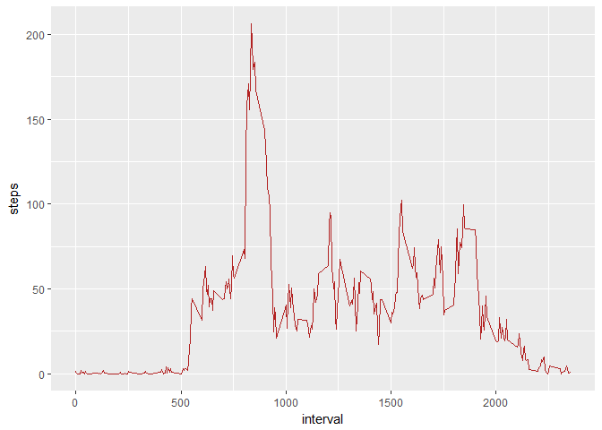
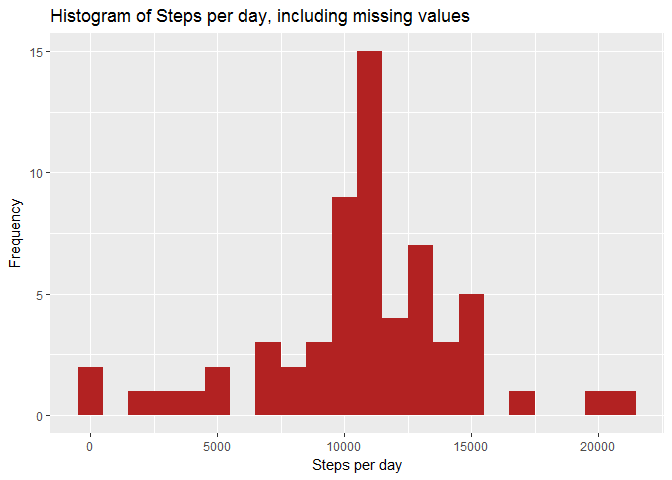

## Loading Required Libraries

```r
library(ggplot2)
library(lubridate)
library(dplyr)
```


## Loading the data

```r
if(!file.exists("activity.csv")){
        unzip("activity.zip")
}
data <- read.csv("activity.csv", stringsAsFactors = FALSE)   
```

## preprocessing the date format in data

```r
data$date <- ymd(data$date)
str(data)
```

```
## 'data.frame':	17568 obs. of  3 variables:
##  $ steps   : int  NA NA NA NA NA NA NA NA NA NA ...
##  $ date    : Date, format: "2012-10-01" "2012-10-01" ...
##  $ interval: int  0 5 10 15 20 25 30 35 40 45 ...
```

```r
head(data)
```

```
##   steps       date interval
## 1    NA 2012-10-01        0
## 2    NA 2012-10-01        5
## 3    NA 2012-10-01       10
## 4    NA 2012-10-01       15
## 5    NA 2012-10-01       20
## 6    NA 2012-10-01       25
```

## What is mean total number of steps taken per day?
1. Calculate the total number of steps taken per day. Ignore the NA Value for Steps

```r
steps <- data %>%
  filter(!is.na(steps)) %>%
  group_by(date) %>%
  summarize(steps = sum(steps)) %>%
  print
```

```
## # A tibble: 53 x 2
##          date steps
##        <date> <int>
##  1 2012-10-02   126
##  2 2012-10-03 11352
##  3 2012-10-04 12116
##  4 2012-10-05 13294
##  5 2012-10-06 15420
##  6 2012-10-07 11015
##  7 2012-10-09 12811
##  8 2012-10-10  9900
##  9 2012-10-11 10304
## 10 2012-10-12 17382
## # ... with 43 more rows
```
2. Plot histogram for total number of steps taken per day

```r
ggplot(steps, aes(x = steps)) +
  geom_histogram(fill = "firebrick", binwidth = 1000) +
  labs(title = "Histogram of Steps per day", x = "Steps per day", y = "Frequency")
```

<!-- -->

3. Mean and median of the total number of steps taken per day

```r
meansteps <- mean(steps$steps)
mediansteps <- median(steps$steps)
meansteps
```

```
## [1] 10766.19
```

```r
mediansteps
```

```
## [1] 10765
```
 

## What is the average daily activity pattern?
1. Make a time series plot (i.e. type = "l") of the 5-minute interval (x-axis) and the average number of steps taken, averaged across all days (y-axis)?

```r
interval <- data %>%
  filter(!is.na(steps)) %>%
  group_by(interval) %>%
  summarize(steps = mean(steps))
ggplot(interval, aes(x=interval, y=steps)) +
  geom_line(color = "firebrick")
```

<!-- -->

2. Which 5-minute interval, on average across all the days in the dataset, contains the maximum number of steps?

```r
interval[which.max(interval$steps),]
```

```
## # A tibble: 1 x 2
##   interval    steps
##      <int>    <dbl>
## 1      835 206.1698
```


## Imputing missing values
1. Calculate and report the total number of missing values in the dataset (i.e. the total number of rows with NAs)

```r
missingvalue <- data %>% filter(is.na(steps)) %>%
        count %>%
        print
```

```
## # A tibble: 1 x 1
##       n
##   <int>
## 1  2304
```
2. Fill in all of the missing values in the dataset using mean of same 5 minute interval. 

```r
data_full <- data
nas <- is.na(data_full$steps)
```
3. Create a new dataset that is equal to the original dataset but with the missing data filled in.

```r
avg_interval <- tapply(data_full$steps, data_full$interval, mean, na.rm=TRUE, simplify=TRUE)
data_full$steps[nas] <- avg_interval[as.character(data_full$interval[nas])]
sum(is.na(data_full$steps))
```

```
## [1] 0
```
4. Make a histogram of the total number of steps taken each day 

```r
steps_full <- data_full %>%
  filter(!is.na(steps)) %>%
  group_by(date) %>%
  summarize(steps = sum(steps)) %>%
  print
```

```
## # A tibble: 61 x 2
##          date    steps
##        <date>    <dbl>
##  1 2012-10-01 10766.19
##  2 2012-10-02   126.00
##  3 2012-10-03 11352.00
##  4 2012-10-04 12116.00
##  5 2012-10-05 13294.00
##  6 2012-10-06 15420.00
##  7 2012-10-07 11015.00
##  8 2012-10-08 10766.19
##  9 2012-10-09 12811.00
## 10 2012-10-10  9900.00
## # ... with 51 more rows
```

```r
ggplot(steps_full, aes(x = steps)) +
  geom_histogram(fill = "firebrick", binwidth = 1000) +
  labs(title = "Histogram of Steps per day, including missing values", x = "Steps per day", y = "Frequency")
```

<!-- -->

... and Calculate and report the mean and median total number of steps taken per day. 

```r
mean_steps_full <- mean(steps_full$steps, na.rm = TRUE)
median_steps_full <- median(steps_full$steps, na.rm = TRUE)
mean_steps_full
```

```
## [1] 10766.19
```

```r
median_steps_full
```

```
## [1] 10766.19
```

The impact of imputing missing data ith the average number of steps in the same 5-min interval is that both the mean and the median are equal to the same value: 1.0766189\times 10^{4}


## Are there differences in activity patterns between weekdays and weekends?
For this part the weekdays() function may be of some help here. Use the dataset with the filled-in missing values for this part.

1. Create a new factor variable in the dataset with two levels - "weekday" and "weekend" indicating whether a given date is a weekday or weekend day.

```r
data_full <- mutate(data_full, weektype = ifelse(weekdays(data_full$date) == "Saturday" | weekdays(data_full$date) == "Sunday", "weekend", "weekday"))
data_full$weektype <- as.factor(data_full$weektype)
head(data_full)
```

```
##       steps       date interval weektype
## 1 1.7169811 2012-10-01        0  weekday
## 2 0.3396226 2012-10-01        5  weekday
## 3 0.1320755 2012-10-01       10  weekday
## 4 0.1509434 2012-10-01       15  weekday
## 5 0.0754717 2012-10-01       20  weekday
## 6 2.0943396 2012-10-01       25  weekday
```
2. Make a panel plot containing a time series plot (i.e. type = "l") of the 5-minute interval (x-axis) and the average number of steps taken, averaged across all weekday days or weekend days (y-axis). See the README file in the GitHub repository to see an example of what this plot should look like using simulated data.

```r
data_full <- mutate(data_full, weektype = ifelse(weekdays(data_full$date) == "Saturday" | weekdays(data_full$date) == "Sunday", "weekend", "weekday"))
data_full$weektype <- as.factor(data_full$weektype)
head(data_full)
```

```
##       steps       date interval weektype
## 1 1.7169811 2012-10-01        0  weekday
## 2 0.3396226 2012-10-01        5  weekday
## 3 0.1320755 2012-10-01       10  weekday
## 4 0.1509434 2012-10-01       15  weekday
## 5 0.0754717 2012-10-01       20  weekday
## 6 2.0943396 2012-10-01       25  weekday
```

```r
interval_full <- data_full %>%
        group_by(interval, weektype) %>%
        summarize(steps = mean(steps))

d <- ggplot(interval_full, aes(x=interval, y=steps, color=weektype))+
        geom_line() +
        facet_wrap(~weektype, ncol = 1, nrow = 2)
print(d)
```

<!-- -->

